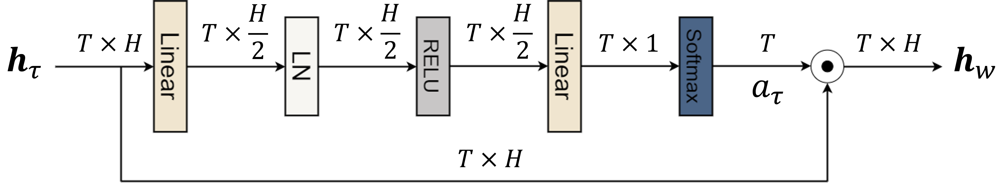

# Temporal_Attention_LSTM

## Introduction and environment

 * This repository implements temporal attention-aware timestep selection (TTS) method for LSTM. 
 * Our research has exerted this technique in neural decoding. Experimental results show that it could **outperform state-of-the-art neural decoders** on two nonhuman primate datasets. In addition, it also **reduces the computation time for prediction**.
 * Here is our environment: 
> * OS: Windows 10
>* Language: python 3.9
>* Packages: includes in `Pipfile`

## Why we need timestep selection

RNN-based neural decoders might cause **latency between the input of neural activity and the response of kinematic state** because of insufficient number of timesteps (time bins) signal.

Therefore, adding both previous and current timesteps signal could **help the model learn neural response dynamics** from neural activity efficiently. 

However, **excessively long neural activity periods results in computational burden** and hinders the decoding performance.  

Accordingly, it is important to **make a trade-off between the computational complexity of decoder and the decoding performance** by selecting adequate number of input timesteps.

## What is temporal attention module (TAM)

The TAM in ours research aims to determine the relative importance of each neural activity timestep and selects essential timesteps by means of attention weight  which is estimated as follows:  

)
  
}}{\sum^T_{\tau=1}\exp{(u^T_{\tau}v)}})

Eventually, the TAM aggregates the hidden states of all timesteps according to the attention weights:  


The structure of our TAM is shown below:



where  and  represent number of timesteps and number of hidden units respectively.

## How to use our model

Our model is written by tensorflow.keras framework, so it could be called by `.compile()` function of tensorflow as shown in the example below:
```py
from models import lstm_decoder 
# import our model from model.py
model = lstm_decoder(tapsize=tapsize, attn=True) 
# define the model (the details of parameters are listed in from model.py)
```
In this way, you could use `.fit` function to train your own data:
```py
model.fit(x=train_x, y=train_y, batch_size=BATCHSIZE, epochs=EPOCH, verbose=0, shuffle=True)
# train_x and train_y represent training data and ground truth respectively
# the details of hyperparameters are list in our paper
```
For more details about the process of training on one of nonhuman primate datasets we used, please refer to `testForRnnInput.py`.
